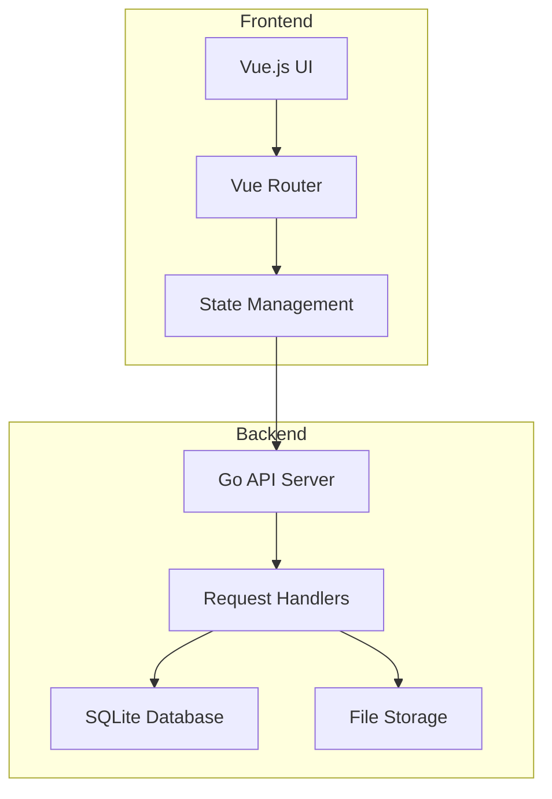
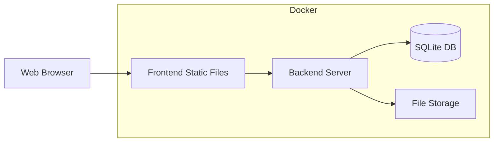

# Architecture Overview

## System Architecture

## Components

### Frontend

#### Vue.js Application

- **Views**

  - `DashboardView`: Displays payment summaries and recent activity
  - `PaymentsView`: Manages payment records and invoices
  - `DocumentsView`: Handles document uploads and organization
  - `TagsView`: Manages tags for categorization

- **Components**

  - `AppLayout`: Main application layout with navigation
  - Form components for data input
  - Table components for data display

- **Features**
  - Responsive design using Vuetify
  - Real-time form validation
  - File upload handling
  - Data visualization for expenses
  - Tag-based filtering and organization

### Backend

#### Go API Server

- Built with Gin web framework
- RESTful API endpoints
- File upload handling
- SQLite database integration

#### Data Layer

- SQLite database for structured data

  - Payment records
  - Document metadata
  - Tag information
  - Relationships between entities

- File Storage
  - Document storage
  - Invoice storage
  - Organized by UUID-based filenames

## Data Flow

1. **User Interaction**

   - User interacts with Vue.js frontend
   - Frontend components update local state
   - API requests triggered for data operations

2. **API Processing**

   - Go backend receives API requests
   - Validates request data
   - Processes business logic
   - Handles file uploads if present

3. **Data Storage**
   - Structured data saved to SQLite
   - Files saved to filesystem
   - Response returned to frontend

## Security Considerations

- Input validation on both frontend and backend
- File type restrictions for uploads
- Size limits for file uploads
- SQL injection prevention
- CORS configuration
- Rate limiting (TODO)

## Deployment Architecture

## Development Setup

The application can be run in two modes:

### Production Mode

- Single container with frontend assets served by Go server
- SQLite database file mounted as volume
- File storage mounted as volume

### Development Mode

- Separate frontend dev server with hot reload
- Backend server with live reload
- Shared volumes for database and storage

## Future Improvements

1. **Authentication & Authorization**

   - User accounts
   - Role-based access control
   - API authentication

2. **Performance**

   - Database indexing optimization
   - Caching layer
   - Image optimization for uploads

3. **Features**
   - Payment scheduling
   - Budget tracking
   - Export functionality
   - Email notifications
