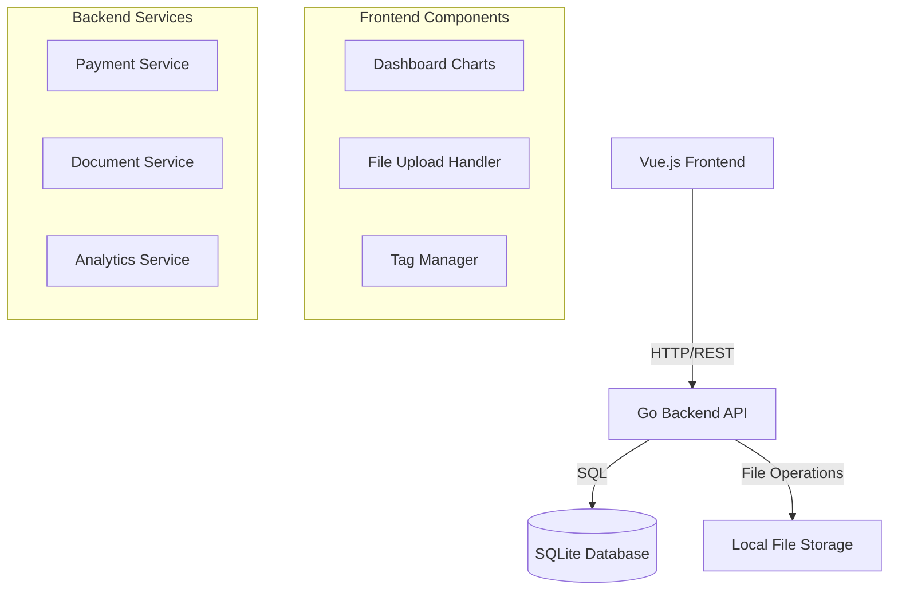
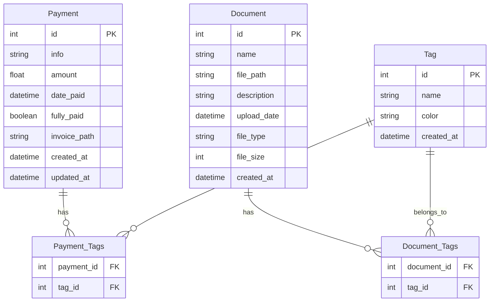
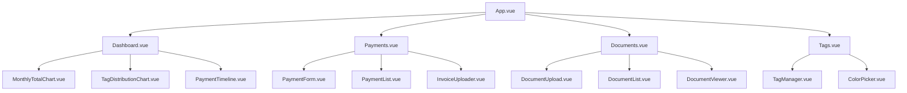

# Home Construction Expense Tracker - Technical Specification

## System Architecture



## Database Schema



## API Endpoints

### Payments

- `GET /api/payments` - List all payments (supports pagination and filtering)
- `POST /api/payments` - Create new payment
- `GET /api/payments/:id` - Get payment details
- `PUT /api/payments/:id` - Update payment
- `DELETE /api/payments/:id` - Delete payment
- `POST /api/payments/:id/invoice` - Upload invoice
- `GET /api/payments/analytics` - Get payment statistics and trends

### Documents

- `GET /api/documents` - List all documents (supports filtering by tags)
- `POST /api/documents` - Upload new document
- `GET /api/documents/:id` - Get document details
- `DELETE /api/documents/:id` - Delete document
- `GET /api/documents/:id/download` - Download document

### Tags

- `GET /api/tags` - List all tags
- `POST /api/tags` - Create new tag
- `PUT /api/tags/:id` - Update tag
- `DELETE /api/tags/:id` - Delete tag
- `GET /api/tags/stats` - Get tag usage statistics

## Frontend Components



## Technical Stack

### Backend

- Go 1.21+
- SQLite3 for database
- Gin web framework
- GORM for ORM
- go-playground/validator for validation

### Frontend

- Vue.js 3 with Composition API
- Vue Router for navigation
- Pinia for state management
- Tailwind CSS for styling
- Chart.js for visualizations
- Axios for API calls

### File Storage

- Local file system storage
- Organized directory structure:
  ```
  /storage
    /invoices
      /YYYY-MM/  # Invoices organized by year-month
    /documents
      /general/  # General documents
  ```

## Dashboard Visualizations

1. Monthly Totals Bar Chart

   - X-axis: Months
   - Y-axis: Total expenses
   - Interactive tooltips showing detailed breakdown

2. Tag Distribution Donut Chart

   - Shows proportion of expenses by tag
   - Interactive legend
   - Click-through to filtered payment list

3. Payment Timeline
   - Chronological view of payments
   - Color-coded by payment status
   - Filterable by date range and tags

## Security Considerations

- Input validation on both frontend and backend
- File type restrictions for uploads
- Maximum file size limits
- Sanitization of file names
- Regular backup strategy for SQLite database

## Performance Considerations

- Pagination for large datasets
- Image/document thumbnail generation
- Caching of dashboard analytics
- Index optimization for frequently queried fields
